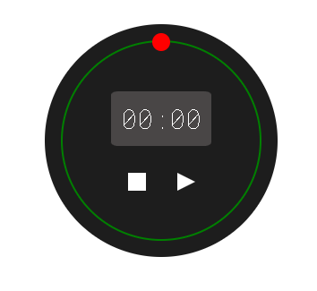

# Cronómetro
Cronometro con minutos y segundos

**Cronómetro desarrollado en este tutorial:** https://youtu.be/kqMUFJp7K24
**Repositorio orígen del Cronómetro:** https://github.com/accesibleprogramacion/cronometro

Tecnologías:
- HTML
- CSS
- JavaScript
